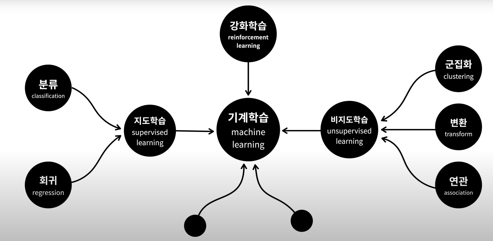

### 학습

국가공인 데이터분석준전문가 ADsP
[개발자가 데이터분석 준전문가되기](https://wikidocs.net/book/3558)
[데이터사이언스스쿨](https://datascienceschool.net/01%20python/04.01%20%ED%8C%90%EB%8B%A4%EC%8A%A4%20%ED%8C%A8%ED%82%A4%EC%A7%80%EC%9D%98%20%EC%86%8C%EA%B0%9C.html)
[판다스10분완성](https://dataitgirls2.github.io/10minutes2pandas/)
[구글 판다스시트](https://pandas.pydata.org/Pandas_Cheat_Sheet.pdf)
[네이버 부스트코스트](https://www.edwith.org/search/index?categoryId=312)
[딥러닝을 이용한 자연어처리입문](https://wikidocs.net/book/2155)

- Teachable Machine 2.0 공식 홈페이지
https://teachablemachine.withgoogle.com/


## 빅데이터

기존DB 관리도구의 수집, 저장, 관리, 분석 역량을 넘어서는 데이터

##### 최근에 빅데이터가 관심을 받는 이유

- 소프트웨어, 하드웨어, 센서 등의 발달로 인한 데이터의 양이 급속도로 증가.
- 저장장치의 가격인하로 경제적 타당성 증가
- 데이터 처리 기술 발달(CPU, GPU, 클라우드, 분산처리, 하둡, 오픈소스 등)


##### 표
표를 이해하는것이 너무너무 중요하다. 표를 데이터셋이라고 한다.
데이터를 표로 담을 수 있다면 분석은 머신러닝이 가능하다.
- 행 : row = 개체(instance), 관측치(observed value), 기록(record), 사례(example), 경우(case)
- 열 : column = 특성(feature), 속성(attribute), 변수(variable), field

##### 변수와 관계
표에서 변수는 열로 표현된다.
- 독립변수 : 원인이 되는 열   
- 종속변수 : 원인에 의해 결과과 되는 열
- 예) 까페에서 매출을 예측해서 미리 주문을 해야함.
      온도 = 원인,   판매량 = 결과
- 두개의 특성이 서로 관련이 있으면 상관있다고 하고 그 관계를 '상관관계'라고 한다.
- 1. 같이 커지고 작아짐 : 온도가 +면 판매량 +, 온도가 -면 판매량 -
  2. 다른 영향을 줄만한 특성이 발견되지 않음
  3. 역은 성립안됨 : 판매량이 달라진다고 온도가 달라지는것 아님
  4. 일정한 패턴이 발견됨
  => 이런 관계를 '인과관계'라고 한다.
     즉 독립변수와 종속변수의 관계를 인과관계라고 하고, 인과관계는 상관관계에 포함된다.

##### 빅데이터의 특징 3V(5V)

Volumn(크기)
Variety(다양성)
Velocity(속도)
Value(가치)
Varacity(정확성)


##### 심리

도구로 생각하면 재밌고 공부로 생각하면 재미가 없다.
이 많은걸 언제다 공부하지 라는 생각이 들면 공부할때가 아니다.
설레여야 한다.
공부하기가 싫어질때가 온다. 인내심이 부족하기 때문이 아니다.
이정도면 충분하다는 뇌의 명령이다. 고도로 발달한 뇌가 경제성이 없다고 판단한것.


#### 데이터의 형태

- 수집형태
  - 정형 : 칼럼단위의 명확한 구분자와 형태가 존재(DB, CSV, 엑셀)
  - 반정형 : 메타데이터와 스키마가 존재(XML, HTML, JSON)
  - 비정형 : 형태가 존재하지 않음(동영상, SNS메세지, 사진, 오디오)
- 수집시간
  - 배치
  - 실시간
- 분석형태
  - 대화형
  - 배치
  - 실시간
  - 기계학습

#### 데이터분석 기법 종류

- 시각화
- 공간분석
- 탐색적 자료분석(EDA)
- 통계분석
- 데이터 마이닝

#### 빅데이터 처리단계

//데이터 수집과 전처리에 분석가의 80% 시간을 투자 0. 문제정의

1. 수집
   //첫행몇개 마지막행을 살펴보고, 유티크식별값을 인덱스로 지정. 각 컬럼의 타입과 결측치 파악
2. 정제(전처리) : 분석가능한 형태로 정리. 포맷, 유효성, 압축  
   일괄적인 방식으로 통합-변환, 누락-결측, 이상데이터, 목적에 맞지 않는 변수혹은 분포, 정규분포로 변환하려는 노력,
3. 적재 : 대량의 데이터를 안전하게 보관하고 분석할수 있는 환경으로 옮기는 것
4. 분석 : 적재된 데이터를 이용하여 의사결정을 위한 데이터를 제공하기 위한 리포트 생성.
   처리엔진, 파티셔닝, 인덱싱 등의 기술이 필요
5. 시각화, 리포팅
6. 피드백

##### 데이터 수집 기술

- Flume
  플룸은 많은 양의 로그 데이터를 효율적으로 수집, 취합, 이동하기 위한 분산형 소프트웨어
- Kafka
  링크드인에서 개발한 오픈 소스. 분산 메시지 시스템. 대용량 실시간 로그처리에 특화
- Sqoop
  관계형 데이터 베이스와 아파치 하둡간의 대용량 데이터들을 효율적으로 변환 하여 주는 명령 줄 인터페이스 애플리케이션
- Nifi
  미국국가안보국 NSA에서 개발. 시스템 간 데이터 흐름을 처리, 관리, 모니터링하기 최적화
- Flink
  오픈 소스 스트림 처리 프레임 워크
- Splunk
  기계가 생성한 빅 데이터를, 웹 스타일 인터페이스를 통해 검색, 모니터링, 분석하는 소프트웨어
- Logstash
  실시간 파이프라인 기능을 가진 오픈소스 데이터 수집 엔진
- Fluentd
  트레저 데이터에서 개발한 로그 수집 시스템.

### 통계용어

- 모집단 : 조사하고자 하는 대상집단 전체
- 표본 : 조사하기 위해 추출한 모집단의 부분
  - 표본추출방법
    - 단순랜덤추출법
    - 계통추출법 : 랜덤으로 구간을 나누고 구간에서 매k번째 추출
    - 집락추출법 : 군집별로 랜덤
    - 층화추출법 : 이질적인 계층들을 고루 대표할수있도록 추출
- 통계량 : 표본을 관측한 결과
- 모수 : 통계량을 통해 추정한 모집단에 대한 정보
- 추정 : 표본으로부터 미지의 모수를 추측하는것, 표본의 통계량으로 모수의 특성을 추측하는 것
- 표본평균 mean : 모든 값을 모든 갯수로 나눈것
- 중앙값 median : 크기순으로 값을 정렬했을때 중앙의값
- 최빈값 mode : 가장 빈도가 높은것
- 분산
- 표준편차
- 표본공간(Sample case) : 어떤 실험을 실시할때 나타날 수 있는 모든 결과들의 집합
- 사건(event) : 관찰자가 관심이 있는 사건.
- T 분포 : 데이터가 연속형일때 두집단의 평균이 동일한지 알고자할때 사용
  자유도가 커질수록 꼬리가 얇아지고 중심부분이 높아진다.
  자유도가 무한대가 되면 표준정규분포와 같은 모양이 된다.
- 카이제곱 분포 : 가설 검증(두집단간의 동질성검증)에 활용
- F 분포 : 두 집단간 분산의 동일성 검정에 사용.
  자유도를 2개 가지고있으며 자유도가 커질수록 정규분포에 가까워짐

## 하둡

- history : 2006년 야후의 더그 커팅이 '넛치'라는 검색엔진을 개발하는 과정에서 대용량의 비정형 데이터를 기존의 RDB 기술로는 처리가 힘들다는 것을 깨닫고, 새로운 기술을 찾는 중 구글에서 발표한 GFS와 MapReduce 관련 논문을 참고하여 개발됨. 이후 아파치 재단의 오픈소스로 공개.
- what, why : 하나의 좋은 컴퓨터 대신 적당한 성능의 여러 컴퓨터를 클러스터화해서 병렬로 동시에 처리하여 처리속도를 높이는 것
  (분산처리를 위한 오픈소스 프레임워크)

### 하이브

하둡 에코시스템 중에서 데이터를 모델링하고 프로세싱하는 경우 가장 많이 사용하는 데이터 웨어하우징용 솔루션

- 하이브의 구성요소
  - UI
  - Driver
  - Compiler
  - Metastore
  - Execution Engine

### 분석프레임

#### MECE

Mutually Exclusive Collectively Exhaustive
항목을 겹치지 않으며, 누락되지 않게 잘 나눈것
예) 서비스의 활성화정도를 측정하려면

- 방문자수
  - 재방문자수 및 재방문율
  - 신규방문자수
- 이용자수
  - 특정 기능 이용자수
    - 신규유저
    - 기존유저
  - 특정 기능 재이용자수 (재이용율)
    - 신규유저
    - 기존유저
- 구매자수
  - 재구매자 및 재구매율
  - 신규구매자 및 구매전환율
  - ARPU, ARPPU, LTV
- 추천(공유)수
  - 추천 제공자수
  - 추천으로 인해 유입된 유저수

### 용어

C : 주요파라미터
C값이 크면 패널티 약해짐(정규화 없어짐),
C값이 작으면 패널티 강해짐(단순모델)
penalty(패널티)
L2 : Ridge, 일반적으로 사용
L1 : LSSO, 변수가 많아서 줄여야할때 사용. 모델의 단순화 및 해석에 용이

- 하이퍼파라미터(초매개변수)
  모델의 성능에 영향을 주는 사람이 값을 지정하는 변수

- 매개변수
  가중치와 편향.  학습을 하는동안 계속 변하는 수

- 데이터마이닝(DM : Data Mining)
  데이터에 유용한 정보를 찾아내는 과정(발견)
  과거에는 알지 못했지만 숨겨진 패턴과 관계를 광맥을 찾아내듯이.
  예를들어 금요일 오전에는 어떤 상품이 잘 팔리는가, 팔리는 상품들간에는 어떤 상관관계가 있는가

- 텍스트마이닝
  사람이 읽기위해 쓴 비구조적인 텍스트를 분석하는 방법론.
  최소 의미단위로 나누는 형태소 분석을 하고, 형태소 간의 관계성 분석

- Cluster
  여러대의 컴퓨터를 연결해서 하나의 시스템처럼 동작하는 컴퓨터들의 집합

- Job / Task
  전체프로세스는 Job. 단위 Map과 Reduce가 Task

- Node
  클러스터내의 컴퓨터(서버) 한대.

- MPP(Massively Parallel Processing)
  OS와 메모리가 분리된 독립적인 다수 서버 상의 병렬 처리

- SMP(Symmetrically Parallel Processing)
  한 서버 내에서 다수 CPU 상의 병렬 처리. 즉 기존 서버의 멀티 태스킹
  MPP와 SMP는 서로 반대되는 개념

- Workflow
  문서, 정보, 태스크가 한 사용자(어플리케이션)에서 다른 사용자로 일련의 업무 절차 규칙에 의한 처리를 위해 전달되는 비즈니스 프로세스의 자동화

- HA(High Availablilty)
  고가용성. A 노드가 장애가 발생했을 시에 대기 중인 B 노드로 교체되는 것.
  HDFS는 데이터 노드와 달리, 네임 노드를 매우 중요합니다. 그래서 네임노드 장애에 대한 대처로 Standby NameNode가 대기하고 있어서, 변경 로그가 동기화되고 있으며 네임노드 장애 발생 시에도 무중단 서비스를 제공한다.

- 데이터웨어하우스(DA : Data Warehouse)
  사용자의 의사결정에 도움을 주기 위하여, 기간시스템의 데이터베이스에 축적된 데이터를 공통의 형식으로 변환해서 관리하는 데이터베이스
  시스템의 데이터베이스는 큰 규모의 데이터조회를 했을때 부하가 발생하게 되는데 그 문제를 해결하기위해 만들어짐.
  비지니스 전체에 해당하는 현재 및 이력 데이터를 저장하며 BI와 분석을 제공한다.

- 데이터 마트
  데이터의 한 부분으로서 특정 사용자가 관심을 갖는 데이터만 따로 빼낸 작은 규모의 데이터 웨어하우스.
  데이터 웨어하우스가 통합의 개념이라면 마트는 요약의 개념.
  그래서 마트는 일부 데이터를 가지고 특정 사용자를 대상으로 합니다.

- 엑사데이터
  오라클사가 천문학적인 돈을 쏟아부어 만든 빅데이터 관련 주력상품.
  하드웨어, 소프트웨어 양면으로 데이터를 분산시켜 고속처리하도록 최적화되어있다.
  뛰어난 성능, 엄청비싼 가격. 경쟁상품으로 그린플럼

- 지수화과정
  indexing. 정확히 비교하기 위해 값을 같은 기준으로 스케일을 조정하는 것
  시작점이 같고, 변화의 정도의 기준

- 정밀도(Precision)
  모델이 True라고 분류한것중 실제 True인 것의 비율

- 재현율(Recall)
  실제 True인 것 중에서 모델이 True라고 예측한 것의 비율

- 과적합(Overfitting)
  훈련 데이터에 대해서만 과하게 학습하면 성능 측정을 위한 테스트 데이터나 실제 서비스에서는 정확도가 좋지 않은 현상이 발생한다.
  이 현상을 막기위해 테스트데이터의 오차가 증가하기 전이나 정확도가 감소하기 전에 훈련을 멈추는것이 바람직하다.

- 과소적합(Underfitting)
  테스트 데이터의 성능이 올라갈 여지가 있음에도 훈련을 덜한 상태.

- 학습률(learning rate)
  w값을 변경할 때 얼마나 크게 변경할지를 결정.  0과 1사이의 값을 가져야함.
  직관적으로 크면 기울기가 최소값이 되는 w를 빨리 찾을수있을것 같지만 발산함.


  
## 분석과 예측

### 전통적 회귀분석(OLS)

Ordinary Least Square

#### 회귀분석(Regression)
통계학의 꽃이라 불린다.
**두개이상의 변수간의 관계**

- 일반적으로 그래프로 표현된다. 종속변수와 독립변수간의 관계를 테스트한다.
  예를들어 미세먼지와 어떤드라마의 시청률
  -> 종속변수에 영향을 미치는 독립변수가 너무 많을때 모든변수에 대해 어떤 변수가 영향을 미치는것인지 논리적으로 나타낼 수 있다.
- 특정 범위 내에서는 연속된 값의 범위내에서 어떤 숫자도 나올 수 있다.
  분류는 결과가 비연속적이다.
  예) 부동산가격이 7억 8456만원이 될수도, 7억 9120만원이 될수도.
- Data가 Stationary(패턴을 보이지 않음)하다는 조건을 만족해야 한다.
  Non-Stationary(패턴을 보임)한 데이터를 쓰면 무조건 상관계수가 매우 높게 나온다.
  예를들어 감비아의 신발 생산량이 증가할수록 우리나라의 1인당 GDP가 증가한다는 말도안되는 결론이 나올수 있다. 이를 허구적회귀(Spurious Regression)이라 한다.

- 평균으로의 회귀. 
  다윈의 친척인 유전학자가 아래와같은 현상을 회귀라고 표현했다.
  예) 부모의 키 기울기가 5인 직선이지만, 자녀의 키는 기울기가 3인직선이 된다.
  정리 : 아주큰키 부모의 자식은 평균적으로 그것보다 작고,
        아주작은키 부모의 자식은 평균적으로 그것보다 커지게 평균에 가까워진다.
  유전에만 벌어지는 현상이 아니라 사회전반적인 현상이다를 발견

- 사례
  - 공부시간과 시험점수의 관계
  - 온도와 레모네이드 판매량
  - 역세권, 조망 등과 집값
  - 온실 기체량과 기온의 변화량
  - 자동차 속도와 충돌시 사망확률
  - 나이와 키


<오해>

<종류>

- ###### 단순회귀분석
  - 독립변수1개(x)가 종속변수y와의 관계가 선형(직선)
  - X값이 주어졌을때 y값 예측가능
- ###### 다중회귀분석(Multiple)
  - 독립변수가 여러개. 종속변수와의 관계가 선형
  - 독립변수간 상관관계가 높아 발생하는 다중공선성문제 처리해야함
- ###### 다항회귀분석(Polynomial)
  - 독립변수의 차수가 n차
  - 데이터의 각 특성을 제곱해준 데이터를 선형회귀로 훈련
  - 단순 선형모델의 한계를 어느정도 극복

<변수선택법>

- All possible regressions
  - 모든 가능한 조합을 따짐
  - 안전한 방법이지만 변수가 많아지면 시간 급증
- Forward stepwise selection
  - 기여도가 높은 변수부터 하나씩 추가
  - 계산이 빠르나 이미 선택된 변수는 다시 제거되지 않음
- Backward stepwise selection
  - 모든변수를 포함한 상태에서 불필요한 변수를 하나씩 제거
  - 중요한 변수가 제외될 가능성이 매우 적음
  - 이미 제외된 변수는 다시 선택되지 않음

#### 시계열분석(Time Series)

시계열데이터 = **일정 시간간격으로 관측된 자료**
시간의 흐름을 파악하는것이 굉장히 중요
회귀분석을 하면서 수없이 만나는 자료는 대부분 **횡단면 자료**(특정한 시점에서 자료를 관측. 자료내 모든 개체가 동일한 시간대를 공유)
과거의 데이터를 분석하여 미래의 영향도를 예측한다.
파이썬의 Datetime, 판다스의 Timestamp

#### 다중공선성

분산팽창지수(VIF:Variation Inflation Factor)로 확인

## 모델

> 모델의 성능은 알고리즘의 차이보다 전처리를 어떻게 했는지에 따라 더 영향을 받는것으로 알려져있다.
- 훈련용, 검증용, 테스트용 데이터로 나누고 훈련용데이터만 훈련에 사용하는것이 좋다.
수능과 비교하자면 훈련용은 학습지, 검증용은 모의고사, 테스트용은 수능
검증용 : 부족한부분이 무엇인지 검증하고 보완
테스트용 : 성능개선에 사용되는것이 아니라 모델의 성능을 수치화하여 평가하기 위해 사용

#### 모델 구축전 확인사항

- 범주형, 연속형 데이터 형식의 적절성
- 이상치 및 결측치 처리 여부
- 스케일링 및 분포 변환
- 다중공선성 문제
- 예측변수(y)의 분포 imbalance 문제
- 변수 축소 및 파생 변수 생성

#### 모델을 구축할때 고려사항

- 목적과 데이터 특성에 맞는 모델은 무엇인가?
- 일반화 가능성은 어떠한가? (overfitting, underfitting의 가능성은?)
- 성능 측정의 지표는? 성능을 높이기 위해 어떻게 Feature Engineering 을 진행할 것인가?
- 제품 혹은 시스템에 모델을 적용할시 계산량이나 언어 특성에 관해 고려할 부분은 무엇인가?
- 모델/파라미터 업데이트 주기 및 방식은 어떻게 협의할 것인가?

##### 최적화모델

목적함수로 시작하는데 목적함수는 최대화해야 하거나 최소화 해야한다.
제한조건이 있다면 반드시 따라야 한다.
예) 경로문제 : 5시안에 100달러로 뉴욕에서 워싱턴으로 가는 최적 경로는?
예2) 냅색문제 : 도둑이 이집에서 한번에 가방에 갖고나올수 있는 가장 가치있는 물건
예3) 연속냅색문제 : 풀기쉽다. 가치있는걸 다담고, 남으면 그다음가치있는걸 담을수있는만큼 담으면 된다.
이론) 데이터 추상화. 가져갔다1, 안가져갔다 0. 물건마다 시그마 1. 무차별대입. 가능한 모든 경우의수. 반드시 정답을 찾지만 효율적이지 않음 2. 애석하게도 냅색문제에 대해서 완벽한 방법은 없다. 그러나 더 좋은 방법은 있다. 3. 탐욕 알고리즘. 가장좋은것이 무엇인지를 가려내는 파라미터를 콜백함수로 전달받는식으로 구현. 구현하기 쉽고 매우 빠르나 최적이 아닐수있는 해를 구함. 1. 정렬하는데 시간걸림. nlogn 2. 물건검사하는 반복. n 3. 그럼 빅오는 nlogn 4. 지역 최적해이지만 전체 최적해가 아닌 문제가 있다.' 5. 좋은 해를 구할수는 있어도 최적해를 구할수는 없다. 4. 동적 프로그래밍 1. 복잡한 문제를 여러개의 문제로 나누어 푸는 방법 2. 이름의 유래 : 수학을 싫어했던 국방부의 예산측정자로부터 수학과 관련없는 이름을 붙혔다. 3. 피보나치. 급격히 늘어난다. 반복하고있는일이 무엇인지 찾아서 제거한다.
한번 계산한값을 또 계산하는것. 저장해놓으면 된다. 동적배열로. 시간과 공간을 맞바꾼다!!! 있으면 가져오고 없으면 계산하여 저장한다. 1. 냅색문제에서는 이전에 뭘 선택했는지와 관계없이 남아있는 가방과 남아있는 물건만 따지면 된다. 그렇기에 중목문제를 푸는것이다.

#### 분류모델

- Logistic Regression
  로지스틱회귀는 이름은 회귀이지만 대표적인 분류문제다.
- Naive Bayes
- k-Nearest Neighbor
- Tree-based Model
  - Decision Tree
  - Random Forest
  - Gradient Boost Regression Tree
- SVM (Support Vector Machines)
- ANN (Artificial Neural Network
  - CNN
  - RNN
-

###### 랜덤워크

시뮬레이션을 어떻게 사용할지에 대한 좋은 실례가 된다.

1. 2차원좌표 중심에서 취한사람의 발걸음. 걸음이 많으면 어떻게 될까?'
   1. 위생검사 실시(확실히 답을 알고있는 경우와 맞춰보기)
   2. 걷는 수가 많을수록 더 멀리 간다.
   3. 왜 이런지 알기위해 시각화해보자.
   4. plot함수 b- 는 블루 실선 , r--는 레드 점선

### 머신러닝
- 알고리즘을 주지 않고 컴퓨터에게 알아서 답을 찾도록 시키는 것
- 머신러닝의 핵심은 우리가 함수를 만드는것이 아니라 데이터를 제공하여 기계가 규칙성을 찾을수있도록 하는것
- 머신러닝은 결국 비교한후 선택하는 것이다.
- 비교해야할 특징이 너무 많을때 결정이 어렵다. 그럴때 인간의 판단을 돕는것. 그 판단력이 머신러닝의 핵심이고 머신러닝에서는 그것을 '모델'이라고 한다.
- 머신러닝을 잘 쓰려면 일단 머신러닝의 사용자가 되어라. 만들어진것으로는 더이상 만족스럽지 않을때 생산자가 되어라.
- 생각만 하면 실현이 되는 세상이다. 몽상을 혁신으로 만들 수 있는 세상이다.
  더이상 최상위권들, 전문가들의의 소유물이 아니다. 공식의 대중화.
- 머신러닝은 딥러닝을 포함하고있는 개념이다.
- 어떤 데이터를 가지고 있느냐에 따라 여러 종류중 하나를 통해 모델을 만든다.

#### 머신러닝 워크플로우
1. 수집
2. 점검 및 탐색
3. 전처리 및 정제
4. 모델링 및 훈련
5. 평가
   1. 4,5 반복
6. 테스트데이터로 4,5,6 반복
7. 배포 //평가가 끝났으면 


#### 머신러닝의 분류(**중요**)

- **지도학습(supervised learning)**
  - 정답(레이블)을 주고 학습(**배움**)
  - 지도학습은 '역사적'이다. 과거사건의 원인과 결과 데이터가 있다.
  - 과거의 데이터가 있어야하고 독립변수, 종속변수로 구분해서 학습시켜야한다.
  - 그럼 컴퓨터는 공식을 만들어내는데 그것을 '모델'이라고 한다.
  - 분류와 회귀로 나뉜다.
  - **분류**
    - 성격에 맞는것들로 분할해서 그룹핑 하는 것
    - 결과(종속변수)가 숫자가 아니라면 분류
  - **회귀**
    - 결과(종속변수)가 숫자이면 회귀


- **비지도학습(unsupervised learning)**
  - 기계에게 데이터에 대한 통찰력을 부여
  - 의미나 관계를 밝혀내어 데이터의 성격을 파악하는것이 목적
  - 비지도학습은 '탐험적'. 독립, 종속변수의 구분 중요하지 않다. 그저 데이터만 있으면 된다. 
  - 군집화, 변환, 연관으로 나뉜다.
  - **군집화(clustering)**
    - 분류와 헷갈리는 개념
    - n등분으로 쪼개진 그룹을 만드는것이 군집화,
      어떤 대상이 어떤 그룹에 속하는지를 판단하는 것이 분류
    - 표의 숫자를 보고 군집화하기 쉽지않을때 좌표평면 사용
    - 표의 데이터가 많고 계속 추가, 수정, 삭제가 된다면 사람이 하기 불가능. 그럴때 머신러닝의 비지도학습의 군집화 사용
    - 예) 이사할때 비슷한것들끼리 모아서 박스
  - **연관**
    - 장바구니학습
    - 고객의 장바구니에 담긴 상품을 바탕으로 관심있어할만한 상품 추천
    - 제품과 이용자가 매우 많다면 제품들간의 연관성을 찾는것을 사람이 하기 불가능. 그럴때 머신러닝의 비지도학습의 연관규칙 사용.
    - 예) 라면과 계란의 상관관계
  - **변환**
  


- **강화학습(reinforcement learning)**
  - 학습을 통해 능력을 향상시키는것은 지도학습과 비슷
  - 규칙은 있는데 답은 없다.어떻게 하는것이 더 좋은 결과(보상)를 내는것인지를 스스로 알아가는것.
  - 수련, 게임
  - 핵심은 일단 해보는것(**경험**)
  - 상태관찰, 판단, 행동, 변화, 상태관찰 반복
  - 환경(environment), 보상(reward), 상태(state), 정책(policy), 행동(action), 에이전트(agent)
  - 행동의 결과가 좋으면 상을 주고, 안좋으면 벌을 주는것을 매우많이 다양한 경험을 통해 최적의 행동경험을 만들어내는 것.
  -> 상태에 따라서 더 많은 보상을 받을 수 있는 행동을 에이전트가 할수있도록 하는 정책을 만드는것이 목적


#### 머신러닝 지도


# 판다스 # pandas

[기본공부](https://wikidocs.net/book/7188)

- 이름
  Python Data Analysis Library
- 역할
  데이터를 분석하기 전 전처리과정에서 사용되는 핵심 패키지
  R의 데이터프레임을 벤치마킹하여 파이썬에서 사용할수있는 형태의 데이터프레임을 제공해준다.
  쉽게말하자만 파이썬에서 만든 엑셀같은 라이브러리

### 환경

pip list 로 현재 깔려있는 패키지 확인

pandas는 과학용 파이썬 배포판인 아나콘다(Anaconda)에 기본적으로 제공
아나콘다를 사용하지 않을 경우에는 pip install pandas 를 통해 설치
설치후에는 import pandas as pd
보통 배열구조, 랜덤값 생성등의 기능을 활용하기위해 numpy와 matplotlib도 같이 import함

텐서플로우 설치할때 다음과 같은 에러 뜨면
에러 : Could not find a version that satisfies the requirement
tensorflow
해결 :

> conda update -n base conda 다깔렸따고 하는거
> conda update --all --yes 하니까 더깔림
> pip install tensorflow 말고 conda install tensorflow
> 그럼 또다른 에러
> Solving environment: failed with initial frozen solve. Retrying with flexible solve.
> PackagesNotFoundError: The following packages are not available from current channels:

- tensorflow
  > conda config --append channels conda-forge
  > conda install slycot control 해도안됨
  > conda config --set channel_priority false 해도안됨

python --version 하면 Python 3.10.4 나오는데 3.8대로 다운그레이드 해라고 해서

> conda install -n VirEnv20220508 python=3.6.8 ## 오 파이썬 버전 바꾸니까 따라서 다른것들도 바꿀거냐고 물어보고 yes
> conda info --envs

### 시리즈 ###Series

- 1차원 자료구조.
  - 컬럼이 없고 인덱스만 존재
  - 넘파이에서 제공하는 1차원배열과 비슷하지만, 각 데이터의 인덱스를 붙일 수 있다.
- 정의
  s = pd.Series([9904312, 3448737, 2890451, 2466052],
  index=["서울", "부산", "인천", "대구"])
- 사용
  - 변수.index : 해당 인덱스만 반환
  - 변수.values : 해당값만 반환
  - 변수[인덱스] : 인덱스에 해당하는 값 선택
  - 변수[조건] : 조건에 해당하는 값 선택
  - 변수.insull() : 누락된 데이터가 있는지 확인
    name속성을 이용하여 데이터에 이름을 붙일 수 있다. 변수.name = "값", 변수.index.name = "값"

## 데이터프레임 (## DataFrame4)

- 2차원 자료구조
  - Series들을 하나의 열로 취급한 집합
  - 인덱스와 컬럼이 존재
  - 데이터프레임으로 만든 변수를 df라고 퉁칠게.
- 사용전 준비
  import pandas as pd
- 생성
  변수명 = pd.DataFrame(데이터)
  //디테일하게는 파라미터가 여러개 있고 아무것도 안했을시 다음과 같이 디폴트로 생성된다.
  class pandas.DataFrame(data=None, index=None, columns=None, copy=None)

  ```python
  data = {
      'year': [2016, 2017, 2018],
      'GDP rate': [2.8, 3.1, 3.0],
      'GDP': ['1.637M', '1.73M', '1.83M']
  }

  df = pd.DataFrame(data)
  ```

  ```python
  col = ['col1','col2','col3']
  row = ['row1','row2','row3']
  data = [[1,2,3],[4,5,6],[7,8,9]]
  df = pd.DataFrame(data=data,index=row,columns=col)
  ```

- 조회
  df['열이름'] 슬라이싱기능이용. #대소문자 구분함. df['A']는 df.A와 동일하고 리턴되는 자료구조는 Series.
  df.열이름
  df[['컬럼1', '컬럼2', '컬럼3']]
  df.loc[레이블] //location. (사람이 읽기좋은방법) 컬럼명이나 조건식으로 데이터에 접근. 하나 혹은 여러개의 요소 리턴
     예) mask1 = result0.loc[(result0['일시'] < '2020-04-01')]
  df.iloc[행인덱스, 열인덱스] //integer location.(컴퓨터가 읽기좋은방법) 행이나 컬럼의 순서를 나타내는정수로 값추출. 하나 혹은 여러개의 요소 리턴
  df.at //loc와 같은 목적, 같은문법. loc보다 2배정도 빠름. 하나의 요소만 리턴
	예) 인덱스로 row1, row2,  컬럼으로 col1, col2가 있는 2짜리 행렬에서
	result = df.at['row1', 'col2']
  df.iat //iloc과 같은목적. 같은문법. loc보다 2배정도 빠름. 하나의 요소만 리턴
  결론 : 단일인덱싱에서는 at, iat사용. 멀티 인덱싱에서는 loc, iloc

df.head(몇개) //디폴트는 첫5개
df.tail(몇개) //디폴트는 마지막5개

- 필터링
  - 단일조건필터링 : df명[df명['컬럼명']==값]
  - 복합조건필터링 : df명[(df명['칼럼명1'] == 값) & (df명['칼럼명2'] == 값)]
  - 비교조건 아무거나 넣으면됨. ==, >, <, !=
- 합치기
  - df.append([df명1, df명2], sort=False) //냅다 그냥 세로로 합치기
  - pd.join(df명1, df명2) //innerJoin같이 합쳐짐
  - pd.join(df1명, df2명, how='outer') //outterJoin같이 합쳐짐. 속성값으로 물론 left, right있음
  - 조인의 개념이기 때문에 행(데이터의갯수)가 늘어난다. 그럼 컬럼을 합칠려면?
- 컬럼명변경 .rename(columns={'원래컬럼명' : '바꿀컬럼명'})

- 수정
    - 컬럼추가
    pd.DataFrame( 변수명, columns = ['컬럼명', '컬럼명'])
    - 행추가
    df.loc['행명'] = [데이터, 데이터, 데이터] # 인덱스이름을 기준으로 행 선택
	df.iloc[인덱스] = [행인덱스, 연인덱스] # 행이나 컬럼의 인덱스를 기준으로 값 추출. 정수값만 들어가야한다.
    컬럼1 값1
    컬럼2 값2
    컬럼3 값3 식으로 가져온다.
    integer location의 약어. 컴퓨터가 읽기 좋은 방법으로 데이터가 있는 위치(순서)에 접근
    - 값변경
- 삭제
    - 변수명.drop("컬럼또는 행명", axis=값)
    //axis의 값은 행이면 0, 열이면 1
    //기존 프레임이 삭제된 이후를 적용학 ㅣ위해서는 inplace=True 옵션 줘야함
- 변수
    - df.shape //데이터프레임의 크기(행수, 컬럼수)
    - df.index
    - df.len
    - df.info() //데이터프레임의 레코드수, 컬럼수, 컬럼별 데이터타입, 메모리사용량 등 전반적인 정보
  
    - df.append //가장뒤에 row추가
    - df.dtypes //각 열의 데이터타입들

- 함수

    - df.concat() //row기준 병합
    - df.groupby('컬럼명')
    - df.sort_index(axis=1) //행과열이름을 정렬하여 나타냄. axis는 정렬할 대상축. 0이면 인덱스기준, 1이면 컬럼기준. ascending=True는 오름차순, False는 내림차순
      값으로 정렬하는 예) df.sort_values(by='기준컬럼명')
    - df.sort_values(by='컬럼명') //값에 의한 정렬
    - 통계함수 min, max, sum, count, mean, var, std, cumsum 등
    - df.describe() //간단한 통계보여줌. 갯수, 평균값, 표준편차, 최소값, 최대값 , 4분위수
      데이터 분포도를 아는것은 머신러닝의 성능을 향상시키는 중요한 요소
    - df.transpose() //행과열 바꾸기
  
    - 외부파일 읽기
    - pd.read_excel('경로')
    - pd.read_csv('경로') 쓰는건 to_csv('경로')
      - 한글이 깨지면 파라미터 추가 encoding='cp949'
    - df.apply(func, axis=0, raw=False, result_type=None, args=(), kwargs)
      데이터프레임에 함수를 적용하여 반환하는 메서드
	- df.applymap(func, na_action=None, **kwargs)
	  객체의 각 요소에 함수를 적용하여 스칼라를 반환하는 메서드
	  예) 모든요소에 대해 제곱시키려면
	  df.applymap(lambda x : x**2,na_action='ignore')
	- df.agg(func=None, axis=0, args, kwargs)    aggregate
	  apply와 비슷하지만 여러개의 함수를 동시에 적용할 수 있음.
	  __name__을 통해 사용자정의 함수명을 지정해서 깔끔하게 정리하는데도 사용가능


- 연산

  - 객체간 연산

    - .add(other, axis='columns', level=None, fill_value=None)
      - 그냥 +와 다른점은 연산이 불가능한 값을 채워줌
      - other : 데이터프레임, 시리즈, 스칼라 등 데이터
      - axis : 더할 레이블 설정. 0은 행, 1은 열
      - level : multiIndex에서 계산할 Index의 레벨
      - fill_value : 누락요소를 이값으로 대체
    - .radd(다른데이터프레임, axis='columns', level=None, fill_value=None)
      - r은 reverse인듯. 순서만 바꾼건데 플러스연산은 순서에 상관없기 때문에 동일한결과
    - 같은 매커니즘으로 sub, mul, div, mod, pow(거듭제곱), dot(행렬곱)
    - 행이나 열끼리 곱함  .prod(axis=None, skipna=True, level=None, numeric_only=None, min_count=0, **kwargs)

  - [객체내 연산](https://wikidocs.net/160081)
    - 반올림 round 인자가 0이면 일의자리까지, 양수n이면 소수점 n자리까지, 음수n이면 10의 n승까지
    - 합계 sum
    - 곱 prod
    - 절대값 abs
    - 전치 transpose
    - 순위 rank
    - 이산차이 diff axis=0이면 바로전 행과의 차이, axis=1이면 바로전 열과의 차이
    - 백분율차이 pct_change
    - 누적계산 expending
      df.expanding(min_periods=1, center=None, axis=0, method='single').추가메서드()
      그냥 df.expanding().추가연산메서드() 하면 해당연산을 누적으로 진행
    - 기간이동계산 rolling
    - 그룹화계산 groupby
    - 지수가중함수 ewm
      최근데이터가 더 큰 영향을 끼치도록 가중치

- 인덱싱


### Panel

- 3차원 자료구조.
- Axis

### matplotlib

파이썬 시각화 라이브러리
matploblib 패키지의 pyplot모듈을 사용하면 매트랩과 비슷한 형태로 그래프를 그릴수 있다.
차트를 세밀하게 제어가능하지만 간단한것을 하기에는 타이핑해야될 코드가 많다.
그럴때는 데이터프레임의 plot 메소드 활용하는것이 좋다.
from matplotlib import pyplot as plt
plt.bar(가로, 세로)
plt.show()

액자의 역할을 하는 Figure
종이 역할을 하는 AxesSubplot

```python
1: import matplotlib.pyplot as plt
2:
3: fig = plt.figure()
4: subplot = fig.add_subplot(1, 1, 1)
5: subplot.plot([1, 2, 3, 4])
6: plt.show()

라인 1: matplotlib.pyplot을 plt라는 이름으로 임포트합니다.
라인 3: Figure 클래스의 객체를 생성합니다.
라인 4: 생성된 Figure 객체의 subplot(1, 1, 1)은 1행 1열의 액자에 첫 번째 종이를 만들라는 뜻입니다. 함수는 종이를 의미하는 AxesSubplot 객체를 반환합니다.
라인 5: AxesSubplot 객체에 그래프를 그립니다.
라인 6: 액자를 보여줍니다.
// plt 모듈의 plot 함수를 바로 사용할 수도 있습니다. 이 경우 여러분은 명시적으로 Figure나 AxesSubplot 객체를 생성하지 않고도 그림을 그릴 수 있습니다.
//Matplotlib 라이브러리로 그래프를 그릴 때 데이터에 한글이 포함되어 있으면 에러가 발생합니다. 이는 기본 설정된 폰트가 한글을 지원하지 않기 때문입니다. 이런 문제를 해결하기 위하여 다음과 같은 코드를 사용하여 먼저 코드가 실행되는 환경이 macOS이면 'AppleGothic' 폰트로 설정하고 그렇지 않다면 한글 윈도우 기본 폰트인 'Malgun Gothic'으로 설정합니다.

```

#### 데이터 합치기(뻥튀기, 조인 등등)

예) result = pd.merge(se20, mi2020,"left",on ="일시")

### Numpy ### 넘파이

Numerical Python
거의모든 과학 및 공학 분야에서 사용되는 오픈소스 파이썬 라이브러리
**다차원 배열** 및 **행렬** 구조가 포함됨
파이썬배열은 여러 데이터타입이 가능하지만 Numpy배열은 같은 데이터타입만 가능.
대신 **연산이 매우 효율적**이고 메모리 최적화
Numpy에서는 차원을 축이라고 한다.
Numpy의 배열은 ndarray이라는 별칭으로 알려져있다.

<사용순서>

1. 넘파이 설치 pip install numpy
2. 넘파이 임포트 import numpy as np

<기본 배열 생성>
np.array(),
np.zeros(),
np.ones(),
np.empty(),
np.arange(),
np.linspace()dtype

<요소 추가, 제거 및 정렬>
np.sort() ,
np.concatenate()

<배열의 모양과 크기파악>
ndarray.ndim, //배열의 축(차원) 수
ndarray.size, //배열의 총 요소수
ndarray.shape //(n,m)
ndarray.dtype //배열의 요소 유형
ndarray.itemsize //각요소의 바이트크기

## scikit-learn ## 사이킷런
파이썬으로 구현된 기계학습 라이브러리
다양한 알고리즘을 제공한다.
- 분류(Classification)
  - Algorithms: SVM, nearest neighbors, random forest 등
- 회귀(Regression)
  - Algorithms: SVR, nearest neighbors, random forest 등
- 군집(Clustering)
  - Algorithms: k-Means, spectral clustering, mean-shift 등
- 차원 축소(Dimensionality Reduction)
  - Algorithms: k-Means, feature selection, non-negative matrix factorization 등
- 모델 선택(Model selection)
  - Algorithms: grid search, cross validation, metrics 등
- 전처리(Preprocessing)
  - Algorithms: preprocessing, feature extraction 등

## 캐글 ## Kaggle

- 2010년에 설립된 데이터분석대회 사이트
- 기관이나 회사에서 분석하고싶은 데이터와 문제를 제출하면 이용자가 문제를 분석하고 해답을 제출한다. 2017년 구글에서 인수
- 대회 기간 동안 리더보드에는 50%의 데이터로 예측한 결과로 점수를 계산하고 기간이 종료되면 주최측이 나머지 50%를 이용하여 정확도를 계산한 결과로 랭킹을 계산합니다. 따라서 대회가 끝날때 까지 정확한 순위는 주최자만 알 수 있습니다.
- 타이타닉 생존자 예측은 타이타닉 탑승자의 정보를 이용하여 생존자를 예측하는 모델을 제시하는 것으로 캐글 입문용 문제로 유명하다.https://wikidocs.net/75067
  1. 훈련용데이터 csv 읽어옴 = "train"
     1. 결측치 확인. Age, Cabin, Embarked. 적절한값으로 채워줌
  2. 파이차트 생성
     1. 성별, 탑승항, 이름에서 탑승자의호칭 추출, 나이, 방번호, 운임, 형제자매여부, 부모자식여부, 혼자인지, 티켓정보로
  3. 전처리
     1. 전처리함수 구현.
        1. female을 0, male을 1로 변환, 탑승항 C를 0, Q를 1, 결측치 채움 등등 이런작업들
     2. 훈련용에 적용
     3. 검증용에 적용
  4. 머신러닝
     1. 훈련용 데이터에 정답이 있는 지도학습
     2. 훈련용 데이터(train.csv)를 6:4의 비율로 훈련용:검증용 으로 분리하여 훈련용으로 모델을 생성하고 검증용으로 모델의 정확도 검증
        데이터의 분리는 사이킷런의 train_test_split 함수로 간단하게 처리가능
     3. 모델 적용하는 함수 정의
     4. 함수에 여러 알고리즘으로 테스트하고 정확도 뽑아보기
     5. 파라미터 설정변경 테스트 반복으로 최적화


#### 자연어처리
> 자연어(natural language) :  우리가 일상 생활에서 사용하는 언어
> 자연어처리((natural language processing) : 자연어의 의미를 분석하여 컴퓨터가 처리할 수 있도록 하는 일

##### 원핫 인코딩(One-Hot Encoding)
- [레퍼런스](https://wikidocs.net/22647)
- 컴퓨터는 문자보다 숫자를 더 잘 처리하기 때문에 자연어 처리를 할때 문자를 숫자로 바꾸는 기법중 하나.
- 단어를 표현하는 가장 기본적인 표현방법
- 단어집합(volcabulary) : 서로다른 단어들의 집합(모든 단어를 중복을 허용하지 않고 모아놓은 것)
  예) book과 book는 다른단어다.
- 원핫벡터 : 단어 집합의 크기를 벡터의 차원으로 하고, 표현하고 싶은 단어의 인덱스에 1의 값을 부여하고, 다른 인덱스에는 0을 부여하는 벡터표현방식으로 표현된 단어
<과정>
1. 텍스트에 단어가 총 5000개가 있다면 단어집합의 크기는 5000
2. 단어 집합의 단어들마다 인덱스 부여
   1. Okt형태소 분석기를 통해 문장의 토큰화
      from konlpy.tag import Okt
3. 원핫벡터 만들기()
   1. 케라스를 이용  to_categorical()


### 뉴럴네트워크
> 사람이 배우는 방식을 기계가 배우는 방식으로 활용
- 인공신경망은 행렬연산이 많다. 
  하나의 행(데이터)을 샘플이라고 하고,   열(독립변수 하나)를 특성이라고 한다.

- 가설(Hypothesis)
  독립변수x와 종속변수y의 관계를 유추하기 위해 수학적으로 세운 식

- 목적함수, 비용함수, 손실함수
  실제값과 예측값에 대한 오차를 보정하기위해
  함수의 값을 최소화하거나, 최대화하거나 하는 목적을 가진 함수 = 목적함수
  그 값을 최소화하려고 하는 함수 = 비용함수, 손실함수

- MSE
  Mean Squared Error = 평균 제곱 오차
  모든 오차의 제곱들을 합쳐서 평균을 내고, 그것을 최소화 하게 만드는 w,b를 만들면
  결과적으로 y와 x의 관계를 가장 잘 나타내는 직선을 그릴 수 있다.

- Optimizer
  최적화 알고리즘.
  머신러닝, 딥러닝에서 학습은 결국 비용함수를 최소화하는 매개변수인 w와 b를 찾기위한 작업인데 이때 사용되는 알고리즘.

- Linear Regression(선형 회귀)
  > y = wx + b    w와 b를 찾아내는 일
  > w는 weight. 머신러닝에서는 가중치라고 불리지만 수학에서는 직선의 기울기
  > 경사하강법 : 임이의 랜덤값 w를 정한뒤 맨아래의 볼록한 부분을 향해 점차 w의 값을 수정해나가는 기법. 미분 기울기 0
  - 단순 선형 회귀 분석
  - 다중 선형 회귀 분석

- Logistic Regression(로지스틱 회귀)
> 이진분류를 위한 대표적인 알고리즘
> 시그모이드 함수 : 출력이 0과 1사이의 값을 가지면서 S자 형태로 그려지는 함수
> 옵티마이저로는 경사하강법 사용
> 비용함수로 평균제곱오차를 사용하지 않는다. 그러할경우 로컬미니멈에 빠질 가능성이 지나치게 높기 때문. 대신 크로스 엔트로피 함수를 사용한다.
 
#### Keras
> 파이썬으로 구현된 쉽고 간결한 딥러닝 라이브러리
> 딥러닝 비전문가도 쉽게 모델을 개발하고 활용할수있는 고수준의 직관적인 API제공
> 케라스는 인터페이스일뿐이고 내부적으로 텐서플로우, 티아노, CNTK 등의 엔진이 구동된다.
> 그리스어로 뿔을 의미.
- 주요특징 4가지
  - 모듈화
  - 최소주의
  - 쉬운 확장성
  - 파이썬 기반
- 텐서플로우 2.0부터 하이레벨 인터페이스로 케라스를 채택했다.
- 구글은 왜 이것을 공짜로 풀었나?  알고리즘보다 중요한건 전문 엔지니어라고 생각했기 때문. 기술경쟁은 공개해도 문제없다는 강한 자신감
- 단점
  - 오류대처의 어려움
  - 참고 문서 부족
  - 다양한 전처리 부족


### TensorFlow
<개념>
- 2015년 구글이 공개해놓은 머신러닝을 위한 엔드 투 엔드 오픈소스 "플랫폼"
- TPU(텐서플로우 프로세싱 유닛)가 공개되면 머신러닝용 GPU 수요가 줄어들것으로 보인다.

<학습>
[공식문서 번역](https://tensorflowkorea.gitbooks.io/tensorflow-kr/content/)


<설치>
- pip install tensorflow(cpu버전)
- pip install tensorflow-gpu(gpu버전)

<사용>
- import tensorflow as tf

